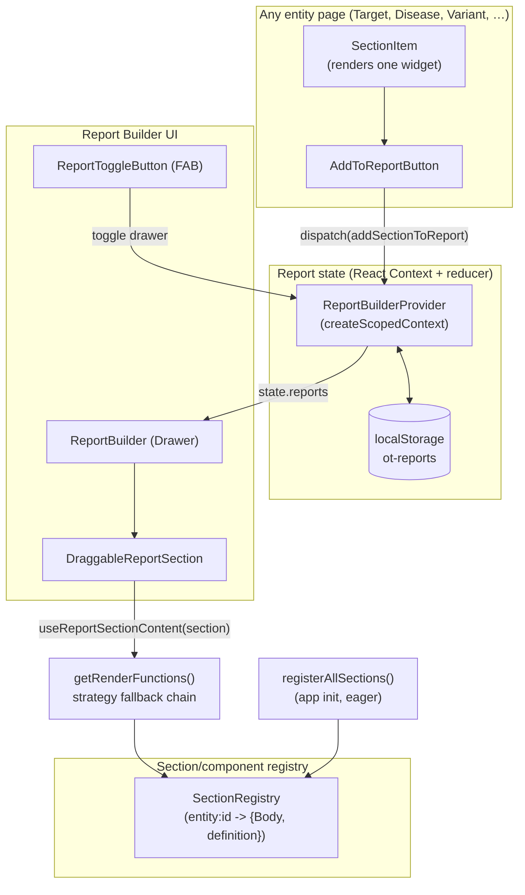

# Report Builder — Architecture & Design Reference

**Status:** early/in-progress feature (branch `do-platform-reports-poc`)
**Scope:** `packages/report-builder/` (one library: `src/core` framework-free core, `src/react` provider/hooks/widget renderer, `src/ui` MUI drawer/blocks/export), the Open Targets adapter in `packages/ui/src/providers/{SectionRegistry,ReportBuilderProvider}.tsx` and `packages/ui/src/components/AddToReportButton.tsx`, and `packages/sections/src/registerAllSections.ts`

> **2026-09-30:** the extraction described in `LIBRARY_DESIGN.md` is largely done. Types, reducer, store, storage, registry, state bag, live capture and the ref/graph utilities live in `packages/report-builder/src/core` (no React); the provider, hooks and headless `WidgetRenderer` in `packages/report-builder/src/react`; the drawer, block views and export in `packages/report-builder/src/ui`. What is left in `ui` is the Open Targets adapter. File paths below that say `packages/ui/src/components/Report/…` now mean `packages/report-builder/src/ui/…`; sections marked *(updated)* were rewritten for the split.

This document describes what exists **today**, verified against the code (not the aspirational docs at the repo root, which describe some not-yet-wired features — called out explicitly below). It's written to be handed to a design tool for wireframing, so it front-loads the mental model before getting into gaps and roadmap.

---

## 1. The idea

Open Targets Platform pages are built from many independent "section" widgets (tables/charts for evidence, safety, pathways, etc.), each scoped to one entity (a target, disease, drug, variant, study, or credible set). Different users — geneticists, pharmacologists, clinicians — care about different subsets of that data, and today they manually screenshot widgets from many different pages to build their own narrative/report.

The Report Builder lets a user:
1. Browse the platform normally, applying whatever filters/views they want on a section.
2. Click **"Add to Report"** on any section, from any entity page.
3. Collect sections from unrelated pages (a disease page, then a target page, then a variant page) into one ordered, named "report."
4. Reorder, rename, export, and revisit that report later — even after closing the tab.

Three explicit long-term goals (from the project owner):
- **Cross-page composition** — done, described in §3–5.
- **Filter-state capture** — the state a user dialed in on a widget (a table filter, a sort order, a selected row) should travel with the section into the report and be restored on reload. **Working for table-backed sections (50 of 74)** — see §7.
- **Extraction as a standalone library** — so any React data platform could adopt this report-builder as a plug-and-play package. Currently not decoupled from this monorepo — see §9.

---

## 2. High-level architecture



The system has four moving parts: **state** (what sections exist, in what order, in which report), **registries** (how to turn a stored section back into a live React component), **context injection** (how a re-rendered section knows which entity/data/local-state it should use), and **UI** (the drawer, drag-and-drop, add-button).

---

## 3. Data model

`packages/ui/src/types/report.ts`

```
Report
 ├─ id, name, description, createdAt, updatedAt
 ├─ entityContext: { type }             // e.g. "disease" — set at report creation
 └─ sections: ReportSection[]
     ├─ reportSectionId (uuid)
     ├─ definition: ReportSectionDefinition   // id, name, entity, isPrivate, componentPath
     ├─ request: ReportRequest                // { loading, error, data, variables }
     ├─ entityId / entityLabel                // e.g. EFO id + disease name
     ├─ renderedContent: { body, chart, description }  // live React nodes, captured at add-time
     ├─ componentState?: Record<string, any>  // intended home for filters/sort/selection — see §7
     ├─ selectedView: "table" | "chart"
     └─ addedAt, tags?, chipText?
```

Key design decision *(updated)*: a section stores only serializable data: the raw GraphQL `request` (data + variables), the entity, the Body's mount props and the captured `componentState`. The earlier same-session cache of rendered JSX (`renderedContent`) is gone; a section is always rebuilt from the registry (§6), so what you see right after "Add" is exactly what you see after a reload.

---

## 4. State container

`packages/report-core/src/reducer.ts`, `store.ts`, `storage.ts`; React binding in `packages/ui/src/providers/ReportBuilderProvider.tsx` *(updated)*

The reducer is a pure action map in `report-core` (`reportReducer`), wrapped by `createReportStore({ storage })`: a tiny external store with `getState / dispatch / subscribe / load / getSaveStatus`. The `ui` provider creates one, calls `load()` on mount and exposes it through `useSyncExternalStore` (`useReportBuilderState`, `useReportBuilderDispatch`, `useReportSaveStatus`, `useReportBuilder`). The store persists on every change to `reports` through the injected `ReportStorage` adapter (default `localStorageAdapter()`, key `ot-reports`; `memoryStorageAdapter()` for tests) and never before the first load has finished. Save failures surface as a status the UI renders (`SaveStatusSnackbar`), not from inside the state layer.

Previously it was built on an in-house factory, `createScopedContext` (`packages/ot-utils/src/createScopedContext.tsx`) — a small Context + `useReducer` wrapper where each action type maps to its own reducer function (`extraActions: { [actionType]: (state, action) => newState }`). This is functionally a hand-rolled version of Redux Toolkit's slice-reducer convention, scoped locally instead of a global store.

Actions: `createReport`, `addSectionToReport`, `removeSectionFromReport`, `reorderSections`, `updateSectionView`, `setActiveReport`, `toggleBuilderOpen`, `deleteReport`, `renameReport`, `clearReport`, `initializeFromStorage`.

**Persistence** (`ReportBuilderPersistenceWrapper`): on mount, reads `localStorage["ot-reports"]` and dispatches `initializeFromStorage`; on every state change, re-serializes and writes back. Serialization explicitly strips `renderedContent` (React nodes aren't serializable) — `initializeFromStorage` sets `body/chart/description` back to `null`, which is why a **reconstruction** step (§6) is needed after reload.

> **Removed:** a second, unrelated persistence utility module, `utils/reportBuilderUtils.ts` (a different localStorage key, `ot-report-builder-reports`, plus CSV/JSON export helpers, duplication/merge helpers, stats helpers) existed alongside `ReportBuilderProvider`'s own persistence but had zero callers anywhere in the repo — `ReportBuilder.tsx`'s export button has its own inline JSON export instead. Deleted as dead code rather than reconciled; if CSV export or report duplication/stats become real features, write them fresh against the current `Report`/`ReportSection` shape rather than reviving that file.

---

## 5. Registry — how a section is discovered and (re)rendered

`SectionRegistry.tsx` *(updated)* is `createRegistry<SectionComponentConstructor>()` from `report-core` (a keyed registry with change notification and an optional async `resolve`), holding `{ Body, definition, exportAdapter }` under a composite id `"<entity>:<definitionId>"`. `registerSectionComponent` / `getSectionComponent` are thin wrappers over it and are the OT host adapter; LIBRARY_DESIGN.md step 2 replaces the entry shape with a core `WidgetDefinition`. Populated **eagerly and synchronously** by `packages/sections/src/registerAllSections.ts`, which is called once at app bootstrap (`apps/platform/src/index.tsx`). It imports every section's `Body` component up front and registers all ~80 of them. This is the registry that `createRenderFunctionsFromMetadata` reads from, and it's what makes report reconstruction after reload work today.

**Key rule:** a saved section is looked up by the `entity` its `SectionItem` was given on the page, not by the folder it lives in. Evidence sections are mounted with `entity="disease"` (evidence page and the associations table's inline sections), so they register as `disease:<id>`; `disease/GWASStudies` and `study/SharedTraitStudies` pass `"studies"` / `"sharedTraitStudies"` and register under those. A section registered under any other key can't be rebuilt after a reload ("Section not available"). `registerAllSections` warns on duplicate keys. The associations-on-the-fly widgets register separately, from the app (`AssociationsToolkit/report/registerAotfSections.tsx`).

> **Removed:** an earlier, parallel lazy-`import()` registry (`ComponentRegistry.tsx` + `ComponentRegistryInit.ts`), documented in the now-superseded root-level `OFFLINE_COMPONENT_REGISTRY.md` / `OFFLINE_COMPONENT_INTEGRATION.md`, was never wired up (`initializeComponentRegistry()` was never called from `apps/`) and had no callers outside its own module besides a dead `if (false)` branch in `SectionRegistry.tsx`. It's been deleted rather than left dormant. Two further dead code paths were also removed: a duplicate, unused `registerSectionComponent`/`getSectionComponent`/`sectionComponentRegistry` triplet that lived inside `DynamicSectionRenderer.tsx` (never imported by anything), and `LazyReportSection.tsx` (also never imported) — both were earlier iterations of "how do we re-render a stored section," superseded by `useReportSectionContent` (§6). `withSectionRegistration.tsx` (an HOC form of registration, unused since `registerAllSections.ts` registers eagerly instead) and `utils/reportBuilderUtils.ts` (an entirely unused, parallel export/persistence utility module — `ReportBuilder.tsx`'s export button and `ReportBuilderProvider`'s persistence each have their own inline implementations) were removed for the same reason: zero callers anywhere in the repo. If lazy-loading becomes a real requirement again (see §9), it should be rebuilt as a host-injected resolver rather than resurrected from this deleted code.

---

## 6. Rendering pipeline — `useReportSectionContent`

`packages/ui/src/hooks/useReportSectionRenderer.tsx`

*(updated)* There is one render path, used both right after "Add" and after a reload:

1. **Registry reconstruction** — look up the Body component in `SectionRegistry` by composite id and call `createRenderFunctionsFromMetadata`, which re-mounts the live `Body` component wrapped in `ReportQueryVariablesProvider` (so it can re-run its GraphQL query with the original `variables`) and `ReportSectionContext.Provider` (so it knows which entity it's describing). It also:
   - replays the Body's **saved mount props** (`section.bodyProps`). Every page mounts Bodies through `SectionBody` (`SectionBodyPropsContext.tsx`), which exposes their props to `SectionItem`, and "Add to Report" stores a plain-data copy. The entity id alone isn't enough: evidence Bodies take `id = { ensgId, efoId }` / `label = { symbol, name }`, study and credible-set pages pass extras (`studyId`, `diseaseIds`, `leadVariantId`), and many tables key their saved state on these props (`dataDownloaderFileStem`), so a wrong prop silently loses the saved filters;
   - provides `PlatformApiContext` from the section's saved request, for the few Bodies that read the page-level query (`usePlatformApi`, e.g. target Molecular Interactions);
   - wraps the Body in an `ErrorBoundary`, so one section failing to rebuild can't blank the rest of the report.
2. **Fallback placeholder** — "Section not available" when nothing is registered under that key.

The same-session cached-JSX path was removed on 2026-09-30 (LIBRARY_DESIGN.md step 1): keeping React nodes in state made it non-serializable and meant a report looked different before and after a reload. Apollo's cache makes the re-mount's refetch free in the common case.

---

## 7. Context injection (the three cross-cutting providers) & filter-state capture

Three React Contexts exist specifically so a `Body` component can behave correctly when rendered *inside the report drawer* instead of on its native page:

| Context | Purpose | Adoption |
|---|---|---|
| `ReportSectionContext` | Gives `entityId`/`entityLabel`/`entityType`, so a Body can prefer this over `useParams()` when reconstructed off-page. | ~11 of 74 `Body` components read it today (rollout tracked in root `BODY_FILE_UPDATES.md` — partially applied, not finished). |
| `ReportQueryVariablesProvider` | Gives the original GraphQL `variables` used at add-time, so a reconstructed Body can re-issue the same query rather than default params. | 2 confirmed usages (`target/Safety`, `evidence/EuropePmc`). |
| `ReportComponentStateContext` | A generic `saveState(key, value)` / `getState(key)` / `getAllState()` bag: the Memento used to capture a widget's local UI state (filters, sort, selection, pagination) at add-time and restore it on reconstruction. *(updated)* The bag itself is `report-core`'s `createStateBag()`; this context is its React binding, and `LiveSectionStateRegistry` is likewise a binding over core's `createLiveCaptureRegistry()`. | **Wired up** (see below) — one consumer today (`OtTable`), covering 50 of 74 sections. |

**How filter-state capture actually works now:**

The gap described in earlier revisions of this doc (nothing wired `onCaptureState`, no live provider existed on source pages, reconstruction didn't seed one) is closed, without needing to touch any individual `Body` file:

1. `SectionItem.tsx` mounts a `ReportComponentStateProvider` around its rendered content — but *only if one doesn't already exist above it in the tree* (checked via `useReportComponentState()` at the top of the component). On a live page there's no ancestor provider, so it creates a fresh one to capture into. When a section is being reconstructed inside the report drawer (see point 3), an ancestor provider is already seeded with the saved state, so `SectionItem` reuses it instead of shadowing it with an empty one. This one conditional is what lets the same `SectionItem` code serve both "capturing on a live page" and "replaying inside a report" correctly.
2. `AddToReportButton` now reads `useReportComponentState()` itself and defaults to `getAllState()` for the state it captures (`onCaptureState` is still honored if explicitly passed, but nothing needs to). Since it's rendered as a descendant of the same provider from point 1, this requires zero per-`Body` wiring — the button and the widget it's attached to already share the same state bag.
3. `createRenderFunctionsFromMetadata` (§6, strategy 2) now wraps its reconstructed `<Body>` in `ReportComponentStateProvider initialState={section.componentState}`, so a reload-and-reconstruct actually restores state, not just same-session drag reordering (which the drawer's cached-JSX path — §6 strategy 1 — already handled via `ReportBuilder.tsx`'s own `DraggableReportSection` wrapping).
4. `OtTable` (the shared table primitive used by 50 of 74 sections — by far the highest-leverage single change, exactly as recommended below) reads its initial `globalFilter` (search text), `columnFilters`, `rowSelection`, `sorting`, and `pagination` from `useReportComponentState()?.getState(key)` at mount, and persists all five into that same key on every change via one `useEffect`. `sorting`/`pagination` were previously uncontrolled internal TanStack state and are now lifted to controlled `state` + `onSortingChange`/`onPaginationChange`, matching the pattern already used for the other three. `OtTableSearch`'s own display-only input state (previously always empty at mount, independent of the table's actual filter) is now seeded the same way, so the search box visibly shows what's actually filtering the table.
   - `key` is `` `otTable:${reportStateKey || dataDownloaderFileStem || "default"}` ``, **not** a single fixed string — a section can render more than one `OtTable` side by side (e.g. `target/Drugs` and `disease/Drugs` pair a master list with a `ClinicalReportsMasterDetailFrame` detail panel, each its own `OtTable` with completely different columns). A shared key meant one table's restored `columnFilters`/`sorting` got applied to the other's columns, which TanStack throws on outright (`Column with id 'x' does not exist`) — caught here in testing via the "Drugs and Clinical Candidates" section. As a second line of defense (in case two tables in one section ever do end up sharing a key), restored `columnFilters`/`sorting` entries are also filtered against the table's actual current column ids before being applied, so a stale or foreign entry is silently dropped instead of crashing the table.

Verified end-to-end in a real browser session (target BRAF page, Safety section): typing a search term, adding the section to a new report, and reopening the report drawer shows the same search text and the same filtered row — both in the same session (cached-JSX path) and after a full page reload (reconstruction path, confirmed via the persisted `localStorage["ot-reports"]` payload actually containing `componentState.otTable.globalFilter`).

**Deliberately out of scope for this pass** (same recommendation as before, now acted on for the highest-leverage case only):
- `OtTableSSP` (server-paginated variant: evidence ClinVar, EVA somatic, IMPC) saves its search and page size under `otTableSSP:<sectionName>`, in the same shape as `OtTable`. The page itself isn't restored (rows are fetched by cursor), so it reopens on page 1.
- **State kept in the Body** (tabs, filters, server-side paging) is captured too: `SectionBody` (the mount wrapper every page uses) holds the section's `ReportComponentStateProvider`, above the Body, and `SectionItem` reuses it. `useReportState(key, initial)` is the `useState` replacement for such state: seeded from the saved value in a report, saved on change, and not saved while it equals `initial` (so defaults add no chip). Used for: Subcellular Location `tab`, Molecular Interactions `source`, Baseline Expression `tab`/`view`, Europe PMC and drug Pharmacovigilance `pagination`, and inside the legacy `DataTable` (search, sort, page under `dataTable:<fileStem or column ids>`, same shape as OtTable's). Bibliography (`common/Literature`) saves its non-default filters under `literature` and seeds its reducer from them; `literatureExportAdapter.describeState` turns them into chips.
- `saveState` keeps the same state object when a value is unchanged. Consumers save on mount; a fresh object every time re-rendered the section, and a child that remounts on each render (Baseline Expression's table) looped.
- Not restored: Baseline Expression's sort/page (its table resets sorting to the most specific data type on mount and on view change), Europe PMC pages beyond the first fetched batch (cursor-based), row expansion.
- Report list drag and drop: each block, its inline inspector and the insert slot under it are one sortable element (`SortableBlock`, which owns `useSortable` and gives rows `handleRef`/`isDragging` through context). dnd-kit moves the sortable element in the DOM while dragging; with the slots as separate siblings they were left behind and blocks lost their spacing until a reload.
- `OtTable` doesn't apply saved filters or sorting to its loading placeholder rows (they're empty objects, and columns' `filterValue`/comparators would crash on them); the saved state applies once rows arrive.
- The per-column filter popover's internal "search within this column's unique values" text box (`OtTableColumnFilter.tsx`) still starts blank on remount — this is a secondary convenience input, not the applied filter value itself (which *is* restored and shown via the filter badge), so it wasn't worth the same treatment.

---

## 8. Design patterns present today

- **Registry / Service Locator** — `SectionRegistry`: string key → component lookup, decoupling the report engine from knowing about specific sections at compile time.
- **Reducer / Flux-lite** — `createScopedContext`'s per-action-type reducer map, same shape as a Redux Toolkit slice, minus the store-wide singleton.
- **Strategy with fallback chain** — `getRenderFunctions()`: try cheap/rich strategies first, degrade gracefully.
- **Dependency injection via Context** — `ReportSectionContext` / `ReportQueryVariablesProvider` / `ReportComponentStateContext` all exist purely to let a component behave differently depending on *where* it's mounted, without prop-drilling through the entire page tree.
- **Memento** — `ReportComponentStateContext` is textbook Memento (originator = `OtTable`, caretaker = report section, memento = the state blob) — wired end-to-end as of §7.

---

## 9. What's blocking "extract this as a standalone library"

> *(updated)* Superseded by `LIBRARY_DESIGN.md`. Items 1 (eager-only registry; core's registry now has an async `resolve`), 4 (hard-coded localStorage; now an injected `ReportStorage`) and the non-serializable state are addressed. Items 2 and 3 remain and are LIBRARY_DESIGN.md steps 2, 5 and 6.

The original analysis, kept for context:

1. **`SectionRegistry` requires eager, synchronous registration.** `registerAllSections()` imports every section's `Body` component up front at app boot (§5). That's the only registration path left after removing the dormant lazy-loading system, but it also means a host app must import and register everything it might ever show in a report before render — there's no way today to register "this section exists, here's how to fetch it when needed" without eagerly pulling in the component. A standalone library would need an async registration/resolution contract (`resolveComponent(id): Promise<ComponentType>`, supplied by the host) rather than requiring whole-app eager imports — this is a real gap now, not just a dormant one, since the lazy-loading attempt was removed rather than fixed. Any reintroduction should be a host-injected resolver function, not a second in-package registry.
2. **MUI + FontAwesome + `@dnd-kit/react` are load-bearing, not swappable.** `ReportBuilder.tsx` and `AddToReportButton.tsx` import MUI components directly; there's no headless/presentational split. A platform using a different design system couldn't adopt the state/logic without also adopting these UI deps.
3. **Domain vocabulary baked into types.** `ReportSectionDefinition.entity` is a free string, but downstream code (`registerAllSections.ts`, section imports) still hard-codes the Open Targets entity set (disease/drug/target/variant/study/credibleSet/evidence).
4. **`localStorage` is hard-coded**, not an injected storage adapter — fine for a proof of concept, blocking for a library that different hosts may want to back with an API, IndexedDB, or nothing at all.

**Suggested target shape**, largely a re-organization of what already exists rather than new invention:
- `report-core` (framework-agnostic): types (§3), the reducer (§4, generalized so `extraActions`/state shape can be OT-agnostic), a registration/resolution contract (§5, generalized from `SectionRegistry` to support async host-supplied resolution instead of eager-only), the render-strategy chain (§6), a `StorageAdapter` interface (get/set/remove) replacing raw `localStorage` calls.
- `report-ui` (React + MUI, this app's presentation layer): `ReportBuilder`, `AddToReportButton`, `ReportToggleButton`, drag-and-drop — consumes `report-core` via hooks, could be swapped per host.
- **Host integration contract**: what `registerAllSections.ts` does today (register every Body against an id) becomes the one thing every adopting app must implement — a small, documented "plugin registration" API, ideally an async/resolver form so hosts aren't forced to eager-load every widget.

This restructuring can be done *in place* inside this monorepo first (folder/package split, no behavior change) before ever being pulled into its own repo — it de-risks the extraction and forces the OT-specific assumptions to surface now rather than during a rushed extraction later.

---

## 10. Current integration points in the platform app

- `apps/platform/src/index.tsx` — calls `registerAllSections()` (the live, eager registry path) before render.
- `apps/platform/src/App.tsx` — mounts `ReportBuilderProvider` around the whole router.
- `apps/platform/src/layouts/RootLayout.tsx` — mounts `<ReportBuilder />` (the drawer) and `<ReportToggleButton />` (the FAB) once, globally, alongside `<Outlet />`.
- `packages/sections/*/Body.tsx` — each entity page's individual widgets; `SectionItem` (used by nearly all of them) is the single choke point where `AddToReportButton` gets attached.

---

## 11. Ideas worth wireframing

For a design pass, in rough priority order matching the three stated goals:

**Building on filter-state capture (goal 2)**
- A visible "filters applied" indicator/chip on a section card in the drawer (surfacing that `componentState` is non-empty), so users trust what they're capturing.
- An explicit "Update snapshot" action per section — re-capture the *current* live state of a widget into an already-added report section, for when a user tweaks filters after adding.
- A diff/compare affordance for two versions of the same section (e.g. "filtered to Phase III" vs "all phases") added side-by-side deliberately, since that's the stated communication goal ("tell a story from a point of view").

**Report authoring / storytelling**
- Section-level annotation/commentary (a text block a user attaches to a widget explaining what it shows and why it matters) — this is the "point of view" part of the ask, and doesn't exist in any form yet.
- Report-level narrative ordering — grouping sections under headings/chapters, not just a flat reorderable list.
- Export to a shareable, styled artifact (PDF/slide deck) beyond the current raw-metadata JSON export.
- A "report from template" starting point (e.g. "Target validation summary" pre-populated with a recommended set of sections) to solve the blank-page problem.

**Cross-page composition (goal 1, mostly built — polish ideas)**
- A lighter-weight "quick add" affordance so adding doesn't require opening the drawer to confirm which report it goes to (badge/menu exists — consider a toast with undo instead of a dialog for the common "add to current active report" case).
- Empty/loading/error states for a section that fails to reconstruct on reload (today it's a plain "Section not available" string).

**Standalone-library framing (goal 3)**
- A "host adapter" concept surfaced in UI terms probably doesn't need its own wireframe — it's a code-organization goal, not a user-facing feature. Not a wireframing priority.

---

## Notebook blocks (`blocks/notebook/`)

A **notebook** block is a JavaScript cell (d3 v7 + Observable Plot) that reads other blocks in the
report as named inputs and returns a chart, a table or a value. Spec: "Report Builder — Notebook
block (3B)".

**Data model.** `NotebookBlock` in `types/report.ts`: `ref`, `inputs: string[]` (refs, chip order),
`code` (body of an async function), `display`, `height`, `runMode`, `hideCodeInExport`, `takeaway`,
`caption`, plus persisted `lastRun` and `snapshot` (SVG ≤ 300 KB, else PNG ≤ 300 KB; data ≤ 200 KB).
Widgets get an optional `ref` the first time they're linked, so every input kind is addressable by
name; `refOf()` / `uniqueRef()` cover data blocks, notebooks and linked widgets.

**Reducer.** `linkNotebookInput` (rejects cycles via `notebook/graph.ts`), `unlinkNotebookInput`,
`setNotebookRun` (last run + snapshot), `renameBlockRef` (renames a ref and rewrites every
notebook's `inputs` and `code`, the latter through acorn so strings and property names are untouched).

**Execution.** User code never runs in the app: `useNotebookRunner` owns a per-block
`<iframe sandbox="allow-scripts">` pointing at `/notebook-runtime/index.html` (built from
`packages/notebook-runtime`, see its README). The runtime's CSP has `connect-src 'none'`, so data
can only enter through linked blocks. Loop guard (2 s per synchronous slice) in the sandbox,
15 s watchdog in the host; **Stop** replaces the iframe. Live results live in
`notebookResultsStore` (like `dataResultsStore`); only `lastRun`/`snapshot` are persisted.

**Inputs.** `resolveInputs.ts` binds each ref to a structured-cloneable value:
widgets → `{ rows, allRows, columns, meta }` (via the section's `exportAdapter.toTable` when it
has one, else the first table in the captured response with OtTable's captured search/filters/sort
applied best-effort), tables → `{ rows, columns, meta }`, GraphQL/REST → `{ data, rows, columns,
meta }` (live result, else snapshot), notebooks → their returned data (`null` when they returned a
chart). `inputsHash` is a cheap version stamp; auto notebooks re-run when it changes, which is
what propagates changes downstream in dependency order.

**Editor.** `NotebookEditor` = CodeMirror `lang-javascript` + completions (`completions/columns.ts`:
refs, fields, column keys, d3/Plot members from generated JSON) + lint (acorn syntax errors and
"isn't linked" warnings with a quick-fix that opens the picker) + snippets. Read view collapses
the code once a notebook has run and lost focus.

**Export.** `collect` turns a notebook into a `figure` (live `serialize` request, else snapshot) or
a `table` (data returns). The code and input refs travel on the IR node's `notebook` field and
into the methods entry unless `hideCodeInExport` is on. Notebook figures default to full-bleed
slides.

## Slides export (`export/slideTheme.ts`, `export/writers/pptx.ts`)

The PPTX writer, the print HTML (`writers/pdf-print.ts` → `slidesToHtml`) and the step-2 preview
(`ui/SlidePreview.tsx`) draw the same slide, in the Open Targets presentation template's style, from
one source of truth:

- `layout.ts` — `SLIDE_BRAND` (navy headings `#1c4a6d`, OT blue / red / grey with 50% and 30% tints,
  grey content box `#eeeeee`), `SLIDE_FONTS` (Trebuchet MS headings, Roboto body) and `SLIDE_TYPE`
  sizes.
- `writers/shared.ts` — `slideFrame(aspect)`: every box in slide inches (kicker, title, content, figure
  + provenance rail, grey panel band, footer text, slide number, logo bottom-right).
- `slideTheme.ts` — the logo SVG (colour and white), the diagonal blue/navy polygons on title and
  section ("PART n") slides, and `titleSlideLayout()` which sizes the title column, steps the title
  font down until it fits, and lays out the meta columns.

Statement slides are navy with white text and the white logo; data slides (appendix tables, data
sources, methods) sit on the grey panel with navy table headers. Change geometry or colours in those
three files, not in a renderer.

## Export render viewport (`export/RenderHost.tsx`)

Widgets are re-rendered for export inside an off-screen `<iframe>` the size of a 16-inch MacBook
Pro display (`EXPORT_VIEWPORT`, 1728 × 1117 CSS px), not in a div of the user's own window. The
iframe is a real viewport: MUI `useMediaQuery` (pointed at the iframe's `matchMedia` through
`MuiUseMediaQuery.defaultProps`), `vh`/`vw`, `window.innerWidth` and ResizeObservers all see a
desktop screen, so tables no longer collapse to mobile column widths when someone exports from a
narrow browser. The page's stylesheets (global CSS, `@font-face`, existing emotion rules) are
serialised into the iframe once; new emotion styles go to an emotion cache whose container is the
iframe's `<head>`. The widget column (`widgetWidth`: 1516 px for 16:9 slides, the section width on
that screen) sits top-left; capture (`captureSvg`, `html-to-image`) works on the iframe's elements.

Three realm quirks the host papers over, each scoped to the screen: the app window's
`ResizeObserver` is wrapped so targets inside the iframe are observed from their own window
(`screenObservers.ts`; Chromium delivers cross-document observations anyway, the spec does not
promise it); the screen's WebGL context prototypes are chained to the app's so
`gl instanceof WebGL2RenderingContext` holds for canvas libraries running in the app realm (Pixi
otherwise drives WebGL2 as WebGL1 and draws nothing); and contexts are created with
`preserveDrawingBuffer` so `toDataURL` reads back the last frame. The iframe sits in the viewport,
transparent, rather than off-screen, so its rendering lifecycle is not deferred.

`ExportRenderHints` (`react/exportRenderHints.ts`, re-exported from `ui`) tells a widget what the
export is for: the slides and video targets pass `maxRows: 10`, and the associations table draws
only that many rows in the figure while `AotfExportTable` still publishes the full page for the
appendix.
