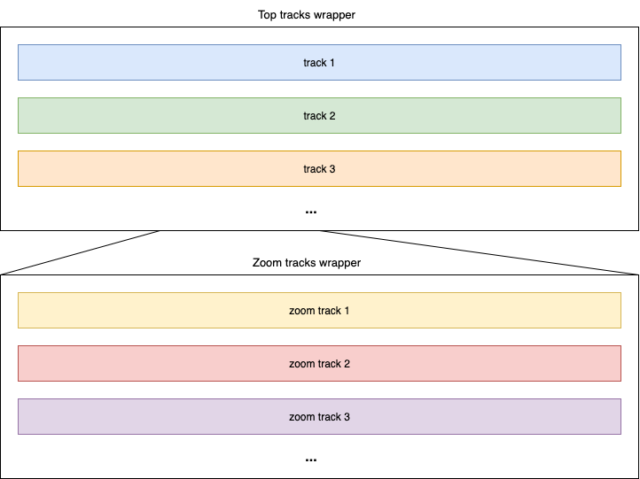
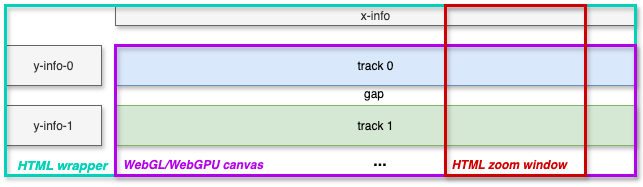

# GenTrack

Flexible 1D-tracks for showing genetic (and related) data.

## Idea



- A __track__ can be used to show anything drawn in a Pixi.js container, e.g. sequence track (colored rectangles), line plot, arrows, etc.
  
- Tracks in the same wrapper share a canvas and x-scale.

- Zoomed track correspond to a window on the outer wrapper's x-scale.

## Design

__Note:__ The diagram below is outdated - the zoom window now has its own HTML container located between the top-level tracks and the zoomed tracks.



- The top-level tracks are drawn on the same cavas. The zoomed tracks are drawn on a second canvas. All tracks on the same canvas will share an x-scale.

- We can write a single `GenTrack` component to use for both sets of tracks. Fixed x-limits can be used for the top tracks whereas the x-limits of the zoomed tracks will be dictated by the zoom window.

- Everything outside the two canvases will HTML/SVG.

- Everything is React - tracks are written in [`@pixi/react`](https://react.pixijs.io/).

- Any combination of tracks can be used at the top-level and the zoom-level - a track can (but need not) be used at both levels. It is fine to use no tracks at the top-level (zoomable tracks only) or have no zoomable tracks.

## Components

#### `GenTrackProvider`

Provides context for the track. Its children should include a single `GenTrack` component along with any other components that need to get/set the context.

| Prop           | Type     | Default    | Description                                                                                                                                                                        |
| -------------- | -------- | ---------- | ---------------------------------------------------------------------------------------------------------------------------------------------------------------------------------- |
| `initialState` | `object` | `{}`       | Initial state that is merged with the 'base' state properties below.                                                                                                               |
| `reducer`      |          | `function` | A reducer function describing valid state changes. Passed the state and an action object. Should return a new state object. The reducer is 'merged' with the 'base' reducer below. |

**Note**: Reducer actions should start by shallow copying the state to ensure the base state properties descibed below are not discarded.

Base state properties:

| Name   | Type     | Default | Description                           |
| ------ | -------- | ------- | ------------------------------------- |
| `data` |          |         | Data to be displayed by the gen track |
| `xMin` | `number` | `0`     | Minimum x value.                      |
| `xMax` | `number` | `100`   | Maximum x value.                      |

The reducer function passed to the provider is augmented with action types to set the base properties:

- `setData`
- `setXMin`
- `setXMax`

Inside a `GenTrackProvider`, we typically fetch/request the data, then when it loads, use `setData` and also `setXMin` and `setXMax` - which usually depend on the data.

Any component inside a `<GenTrackProvider>` can import the following (from the same file as the provider comes from):

- `useGenTrackState`: get the state object.
- `useGenTrackDispatch`: dispatch function for changing state - passed an action object.

__Note:__ The code wrapping the gen track can use `useGenTrackDispatch` but should not consume the state (i.e. use `useGenTrackState`) whereas content inside the `GenTrack` can use the state but should not use the dispatch.

#### `GenTrack`

Top-level gen track component. This contains the x-info and tracks (each of which contains its own y-info). A `GenTrack` component should be inside a `GenTrackProvider` - and a `GenTrackInnerProvider` if showing inner tracks.

| Prop                    | Type                                             | Default        | Description                                                                                                                                                                                                                                                                                                                                                                                                          |
| ----------------------- | ------------------------------------------------ | -------------- | -------------------------------------------------------------------------------------------------------------------------------------------------------------------------------------------------------------------------------------------------------------------------------------------------------------------------------------------------------------------------------------------------------------------- |
| `tracks`                | `Track[]`                                        |                | Tracks.                                                                                                                                                                                                                                                                                                                                                                                                              |
| `XInfo`                 | `component`                                      |                | React component to show info about the shared x scale - e.g. a label and axis. Can take `data`, `start`, `end`, `isInner` and `canvasWidth` props.                                                                                                                                                                                                                                                                   |
| `XYInfo`                |                                                  |                | Rendered inside a container with width equal to `yInfoWidth` and height equal to `xyInfoHeight`. Can take `data` and `isInner` props.                                                                                                                                                                                                                                                                                |
| `xyInfoHeight`          | `number`                                         | `32`           | Height of `XInfo` and `XYInfo` containers.                                                                                                                                                                                                                                                                                                                                                                           |
| `Tooltip`               | `component`                                      |                | Tooltip - see [Tooltip](#tooltip).                                                                                                                                                                                                                                                                                                                                                                                   |
| `tooltipProps`          | `object`                                         |                | Additional tooltip options: `xAnchor`, `yAnchor`, `dx`, `dy`.                                                                                                                                                                                                                                                                                                                                                        |
| `innerTracks`           | `Track[]`                                        |                | Inner tracks.                                                                                                                                                                                                                                                                                                                                                                                                        |
| `InnerXInfo`            | `component`                                      |                | React component to show info about the shared x scale - e.g. a label and axis. Can take `data`, `start`, `end`, `isInner` and `canvasWidth` props - `InnerXInfo` __must__ take a `canvasWidth` prop (even if unsued) to ensure correct behavior.                                                                                                                                                                     |
| `InnerXYInfo`           |                                                  |                | Rendered inside a container with width equal to `yInfoWidth` and height equal to `innerXYInfoHeight`. Can take `data` ans `isInner` props.                                                                                                                                                                                                                                                                           |
| `innerXYInfoHeight`     | `number`                                         | `32`           | Height of `InnerXInfo` and `XYInfo` containers.                                                                                                                                                                                                                                                                                                                                                                      |
| `InnerTooltip`          | `component`                                      |                | Tooltip for inner tracks - see [Tooltip](#tooltip).                                                                                                                                                                                                                                                                                                                                                                  |
| `innerTooltipProps`     | `object`                                         |                | Additional inner tooltip options: `xAnchor`, `yAnchor`, `dx`, `dy`.                                                                                                                                                                                                                                                                                                                                                  |
| `yInfoWidth`            | `number`                                         | `160`          | Space on left reserved for y-info of tracks.                                                                                                                                                                                                                                                                                                                                                                         |
| `yInfoGap`              | `number`                                         | `16`           | Horizontal space between yInfo components and tracks.                                                                                                                                                                                                                                                                                                                                                                |
| `paddingBottom`         | `number`                                         | `16`           | Padding inside the canvas below the bottom track - use the `paddingTop` of individual tracks for padding above tracks.                                                                                                                                                                                                                                                                                               |
| `panZoomTopGap`         | `number`                                         | `16 `          | Vertical space above pan-zoom panel.                                                                                                                                                                                                                                                                                                                                                                                 |
| `panZoomBottomGap`      | `number`                                         | `16 `          | Vertical space below pan-zoom panel.                                                                                                                                                                                                                                                                                                                                                                                 |
| `overlayZoombar`        | `boolean`                                        | `false`        | When `true`, the pan-zoom bar overlays the full height of the top-level tracks instead of sitting between the top-level and inner tracks. `panZoomTopGap` and `panZoomBottomGap` are ignored. Requires at least one top-level track (throws if not).                                                                                                                                                                 |
| `crosshairs`            | `"none" \| "both" \| "horizontal" \| "vertical"` | `"both"`       | Which crosshair lines to show. `"none"` hides them; `"both"` shows vertical and horizontal; `"horizontal"` or `"vertical"` shows only that line.                                                                                                                                                                                                                                                                     |
| `zoomLines`             | `boolean`                                        | `false `       | Indicate zoom window on top-level canvas.                                                                                                                                                                                                                                                                                                                                                                            |
| `initialZoom`           | `number[]`                                       | `[xMin, xMax]` | Initial limits for pan-zoom window. Should be within the x-limits used for the top-level tracks.                                                                                                                                                                                                                                                                                                                     |
| `overlayGraphics`       | `ReactNode`                                      |                | Pixi React content rendered inside an additional `<Container>` on top of the outer canvas (painted after every track's `Container`) — use for cross-track overlays such as vertical lines or highlights.                                                                                                                                                                                                             |
| `innerOverlayGraphics`  | `ReactNode`                                      |                | Same as `overlayGraphics` but rendered on the inner (zoomed) canvas.                                                                                                                                                                                                                                                                                                                                                 |
| `underlayGraphics`      | `ReactNode`                                      |                | Pixi React content rendered inside an additional `<Container>` on the outer canvas, painted *before* every track's `Container` (i.e. behind all track content). Only visible wherever no track's own background paints over it — e.g. useful to fill the padding gaps between stacked tracks with a line/color that individual tracks also redraw over their own backgrounds via `confineToTrack` (see `DataVLine`). |
| `innerUnderlayGraphics` | `ReactNode`                                      |                | Same as `underlayGraphics` but rendered on the inner (zoomed) canvas.                                                                                                                                                                                                                                                                                                                                                |
| `onInnerScalesReady`    | `function`                                       |                | Callback fired once the inner track's `scalesRef` is ready. Receives the inner `RefObject<ScalesRef>`. Useful when content passed via `innerOverlayGraphics`/`innerUnderlayGraphics` needs access to the inner coordinate space (e.g. to position a vertical line correctly).                                                                                                                                        |

A `GenTrack` fills the width of its parent container.

#### Tracks

The `tracks` prop of a `GenTrack` should be passed an array of objects, where each object has the form:

| Property         | Type        | Default     | Description                                                                                                                                                                                                                                                                                                                      |
| ---------------- | ----------- | ----------- | -------------------------------------------------------------------------------------------------------------------------------------------------------------------------------------------------------------------------------------------------------------------------------------------------------------------------------- |
| `id`             | `string`    |             | Unique id for the track. Typically a readable name, e.g. `'domains'`.                                                                                                                                                                                                                                                            |
| `yMin`           | `number`    | `0`         | Minimum y value for y-scale.                                                                                                                                                                                                                                                                                                     |
| `yMax`           | `number`    | `100`       | Maximum y value for y-scale.                                                                                                                                                                                                                                                                                                     |
| `YInfo`          | `component` |             | Rendered inside a container with width equal to the `yInfoWidth` of the parent `GenTrack` and height equal to `height`. Can take `data` and `isInner` props.                                                                                                                                                                     |                                                    |
| `Track`          | `component` |             | Passed an `isInner` prop. Should return a Pixi display object such as a container, sprite or graphics object. This is wrapped in a container that is vertically translated to the appropriate part of the canvas, stretched to the width of the canvas, given height equal to `height` and given the appropriate x and y scales. |                                                    |
| `onTick`         | `function`  |             | Called every tick. Passed the Pixi container that wraps the tracks content.                                                                                                                                                                                                                                                      |
| `height`         | `number`    | `50`        |
| `paddingTop`     | `number`    | `0`         | Padding above track.                                                                                                                                                                                                                                                                                                             | Height of `YInfo` container and `Track` container. |
| `Legend`         | `component` |             | Optional HTML legend. Receives `data` and `isInner`.                                                                                                                                                                                                                                                                             |                                                    |
| `legendPosition` | `string`    | `top-right` | Legend corner: `top-left`, `top-right`, `bottom-left`, or `bottom-right`.                                                                                                                                                                                                                                                        |                                                    |

##### DOM overlays above the canvas (e.g. `Legend`)

PixiJS tracks pointer movement via a `document`-level listener that hit-tests the scene graph directly from raw page coordinates — entirely bypassing DOM occlusion/z-index. This means a `Legend` (or any other DOM element positioned above the canvas) does **not**, on its own, stop Pixi from firing `pointerover`/`pointerdown`/`pointertap` on a sprite underneath it.

`DataSprite` and `DataGeneBox` guard their entry-type handlers (`pointerover`, `pointerdown`, `pointertap`) with `isPointerOverCanvas` (see `pointerOcclusion.ts`), which checks the real topmost DOM element at the event's screen position and rejects it if that element is inside something tagged `data-gentrack-overlay-blocker`. `TrackLegendsLayer`'s interactive corner box already carries this attribute. If you add another DOM overlay that should similarly intercept sprite hover/click, tag it with `data-gentrack-overlay-blocker` too. Exit-type handlers (`pointerout`) are always left unguarded so hover state still clears correctly.

Inside either the `Track` itself or one of its ancestors, it is standard use `useGenTrackState` to access the data and x-limits.

`YInfo` components belonging to an outer `GenTrack` can set the outer or inner state (`useGenTrackDispatch` and `useGenTrackInnerDispatch`). `YInfo` components inside an inner `GenTrack` can access the outer state (`useGenTrackState`).

#### Inner track panning

When `innerTracks` are used (zoomed tracks), the inner/zoomed canvas supports horizontal drag-to-pan:

- The cursor becomes a `crosshair` over the inner canvas when panning is available.
- It switches to `move` while dragging.
- Panning is disabled when the cursor is over a datum that triggers a tooltip (so tooltip interactions still work).
- Panning updates the view in real time and keeps the outer `PanZoomPanel` window in sync.

This only applies to the inner (zoomed) canvas; the outer top-level tracks are already panned by dragging the `PanZoomPanel` window.

#### Tooltip

Use the `Tooltip` and `InnerTooltip` properties of the `GenTrack` component to pass tooltip components for top-level and inner tracks respectively.

`yAnchor: "adapt"` positions the tooltip above or below the pointer, choosing
the side with more room in the viewport. Use
`yAnchor: "anchorAdapt"` when `globalXY` also contains `boxTopPageY` and
`boxBottomPageY`; it positions the tooltip above or below those generic anchor
bounds, choosing the side with more room in the viewport.

For a nested canvas, include `pointerPageY` in `globalXY` so `"adapt"` can use
the browser pointer position rather than canvas-relative coordinates.

If using `Tooltip` or `InnerTooltip`, wrap the GenTrack content in a `GenTrackTooltipProvider`, e.g.

```jsx
<GenTrackProvider initialState={{ data, xMin: 200, xMax: 700 }} >
  <GenTrackTooltipProvider >
    <BodyContentInner data={data} />
  </GenTrackTooltipProvider>
</GenTrackProvider>
```

Inside the component where the tracks are defined, get the tooltip dispatch function:

```js
const genTrackTooltipDispatch = useGenTrackTooltipDispatch();
```

When drawing with Pixi, use `eventMode: "static"` to make sprites/objects interactive. Also add event handlers which use the dispatch function to set any of the `datum`, `otherData` and `globalXY` properties of the tooltip context. E.g.

```jsx
<Sprite
  eventMode="static"
  pointerover={e => {
    genTrackTooltipDispatch({ type: "setDatum", value: d });
    genTrackTooltipDispatch({ type: "setGlobalXY", value: { x: e.global.x, y: e.global.y } });
  }}
  pointerout={e => {
    genTrackTooltipDispatch({ type: "setDatum", value: null });
    genTrackTooltipDispatch({ type: "setGlobalXY", value: null });
  }}
  // ... other Sprite props
/>
```

Inside the tooltip component passed to `GenTrack`, access the tooltip context as required. E.g.

```jsx
function MyTooltip() {
  const { datum } = useGenTrackTooltipState() ?? {};
  if (!.datum) return null;
  return (
    <Box sx={{ p: 0.5, border: "1px solid #bbb", borderRadius: 2, bgcolor: "#fff" }}>
      {JSON.stringify(datum)}
    </Box>
  );
}
```

#### Click-to-stick tooltip

Pass `stickyOnClick: true` in `tooltipProps`/`innerTooltipProps` to make clicking a datum lock ("stick") its tooltip open instead of dismissing on `pointerout`, so the tooltip content can contain interactive elements (links, tables, etc.) without disappearing when the cursor leaves the sprite. This only applies to the inner (zoomed) canvas, matching the existing datum-click gating.

`stickyOnClick` and `onDatumClick` are mutually exclusive on a given `Tooltip`/`InnerTooltip` config — if both are set, `stickyOnClick` wins and a dev-only console warning is logged. Prefer putting any click-triggered navigation/actions inside the tooltip content itself (e.g. a `Link` in the tooltip) rather than on `onDatumClick`, since a click no longer has a "free" meaning once sticky is enabled.

While sticky:

- Highlighting the stuck gene's box (`DataGeneBox`'s `isMyGeneSticky`) is currently a **known, non-functional, deferred bug** — see the important note below for why, and why the obvious fix (reading tooltip state where context reads actually work, and passing it down as a prop) can't be done naively. There is also no equivalent highlight for variants or other entity types — generalizing this into a shared, performant hover/sticky-highlight mechanism is tracked as follow-up work.
- The tooltip continues to track the datum's position through pan/zoom/scroll (see the `sticky`/`stickyGenomicX`/`stickyLabelCenter` state in `GenTrackTooltipProvider` and the tracking loop in `GenTrackTooltip`), and auto-dismisses if the widget is resized or the datum scrolls out of meaningful view.
- Clicking a different datum switches the stuck tooltip to it; clicking the same stuck datum again, or clicking empty canvas, dismisses it; pressing Escape while the tooltip has focus also dismisses it.

All of this is implemented with component-scoped event handlers only (the canvas's own `onClick`, and a `tabIndex`/`onKeyDown` on the tooltip itself) — there is deliberately no global `document`-level listener. One consequence: clicking outside the widget entirely (elsewhere on the page) does **not** dismiss a stuck tooltip.

##### Important: context reads don't work inside the Pixi tree

`@pixi/react`'s `<Stage>` renders its children through a **separate React reconciler root** (its own `PixiFiber`/`react-reconciler` instance), not the surrounding DOM tree's reconciler. Props and closures cross that boundary fine (e.g. `genTrackTooltipDispatch`, captured outside `<Stage>` and passed down, works correctly when invoked from a sprite's `pointerover` handler) — but a `useContext`/`useGenTrackTooltipState()` call made *inside* a component that only ever renders inside `<Stage>` (e.g. `DataGeneBox`, `DataSprite`) does **not** resolve against the real Provider; it silently falls back to the context's default value.

This is why `scalesRef` is threaded through as an explicit ref/prop rather than read via context. It's also why `DataGeneBox`'s existing `useGenTrackTooltipState()` call for `isMyGeneSticky` (which pre-dates click-to-stick) has always been a no-op — it never actually detects tooltip state changes, so the box's highlight never persists once the pointer leaves it, regardless of sticky state.

Moving that read up to `getGenesTracks.tsx` (which runs in the outer DOM tree, where context reads do work) and passing the result down as a prop was tried and **reverted** — it fixes the read, but subscribing `getGenesTracks()`/`GeneVisInner` to `useGenTrackTooltipState()` means the whole (expensive) `GeneVisInner` tree re-renders on every `hover` change, i.e. on every pointer movement over any sprite, not just on the rare `sticky` transitions. That cascades into `GenTrack`'s resize-handling effect (which hides the canvas while recomputing) firing far more often than intended, causing visible flicker/disappearance across the whole visualization on hover.

The correct fix needs to avoid subscribing to the full, high-frequency tooltip state just to read the low-frequency `sticky`/`stickyLabelCenter` fields — e.g. by splitting those into a separate, infrequently-changing context, or using an imperative ref-based/event-driven update path (matching how `scalesRef` position updates and hover-tint changes already bypass React reactivity entirely). This is left as follow-up work alongside the highlight generalization above.

#### Improvements/Features To Add

- Allow 'underlay' and 'overlay' components to draw arbitraty content over the entire canvas. E.g.
  - draw linking enhancers in one track to genes in another

- Tooltip position currently at mouse position. Allow passing e.g. a `position` prop:  a functoin with access to data, otherData, globalXY as well as scales to get from data->canvas coodinates.

- Improves appearance of pan-zoom:
  - in pan-zoo bar: white/transparent backround in visible window, light gray in regions either side where not in window
  - mirrored on canvas so light grey over regiosn either side of window
  - no blue, only dark grey for controls and window boundaries
  - replace handle rectangles with triangles poining outward

#### Bugs/Issues

- Circle sprites are jagged - particulalry at low zoom. I have tried various suggested fixes for when getting texture from graphics object. Alternative that have used previously is to get the texture from an image instead.

- Is the initial width of the inner tracks canvas sometimes too narrow? - then coorects after first interaction with zoom window?

- Is rescaling every frame purely to get fixed pixel size marks expensive? If so, could only change scale when canvasWidth or x-limits change?

- move the tickScaleFactory into main component and document with examples

#### Notes

- __Important__: switched order that spread `extraStateProperties` and `initialState` in `createScopedContext`.tsx so that can initialise extra state properties when create the provider. Make sure happy this is appropriate and does not break any existing use of `createScopedContext`.

- Could investigate `pixi-viewport` for zooming, panning etc. and 'culling' for allowing inexpensive unseen elements.

- Data

  - Should process data as much as possible so not redoing it on redraw.
  
  - Need to consider file formats, dynamic fetching/streaming etc. but leave this until later.

- There are existing libraries, but they tend to be large and overkill for what we need (e.g. HiGlass and libraries that use it like Gosling.js(?), use SVG or basic canvas (so performance issues likely) or not particularly popular or frequently updated. Using Pixi.js will give us full flexibility and integration into React while still being quite high-level (for a WebGL library) and high performance.
